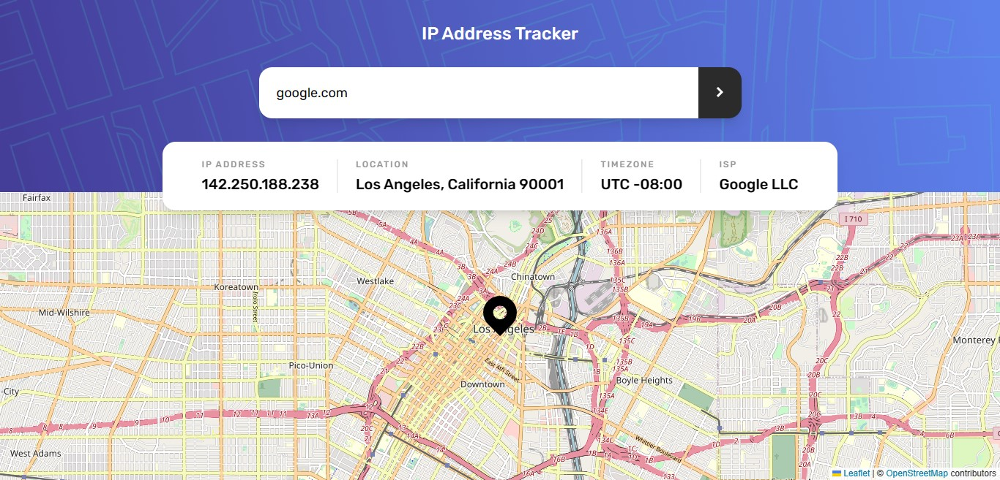

# Ip Address Tracker Web App

This is my solution to the [IP address tracker challenge on Frontend Mentor](https://www.frontendmentor.io/challenges/ip-address-tracker-I8-0yYAH0).

## Table of contents

- [Overview](#overview)
  - [The challenge](#the-challenge)
  - [Screenshot](#screenshot)
  - [Links](#links)
- [My process](#my-process)
  - [Built with](#built-with)
  - [Personal notes](#personal-notes)
- [Author](#author)

## Overview

This challenge is to build out IP Address Tracker app and get it looking as close to the design as possible.

### The challenge

In this app, users will be able to:

- View the optimal layout page depending on their device's screen size
- See hover states for all interactive elements on the page
- See their own IP address on the map on the initial page load
- Search for any IP addresses or domains and see the key information and location

### Screenshot



### Links

- Solution URL: [Frontend Mentor Solution Page](https://www.frontendmentor.io/solutions/ip-address-tracker-9juEu3ylCP)
- Live Site URL: [IP Address Tracker App](https://ip-address-tracker-kiflanadli.vercel.app/)

## My process

### Built with

- React
- SCSS
- Axios
- [IP Geolocation API by IPify](https://geo.ipify.org/)
- [LeafletJS](https://leafletjs.com/)
- [React leaflet](https://react-leaflet.js.org/)

### Personal notes

I use one-time trial for accessing ipify api, with the requests limit of 1000. But using the "Country + City" API type feature, the credit cost per request is 2, so it is the same as my app can only make 500 requests. This app is required to be able to get user's IP address on the initial page load, thus my available requests will be diminished in no time during the development and every time users visiting this app (if any).

To minimize the request being made, At first (during development) I used local web storage to store client IP's address after the initial page load and whenever user search with empty input. So whenever I refresh/revisit the page, it will use the cached data instead of straining my balance requests.

```
const output = useAxiosGet(url);

useEffect(() => {
const localData = localStorage.getItem("data");
if (input === "" && output.data && !localData)
    localStorage.setItem("data", JSON.stringify(output.data));
}, [input, output.data]);
```

This way, it helps me during the development (I really used a lot of requests because there was a bug in my HttpRequests code).

After the development was finished, I changed the code to use sessionStorage so that there would be no issue regarding private data for users.

```
const localData = sessionStorage.getItem("data");
if (input === "" && output.data && !localData)
    sessionStorage.setItem("data", JSON.stringify(output.data));
```

I understand that this results more requests will be made compare to using localStorage (because the session data is deleted when user close the browser/tab), however privacy is more important than my balance requests. And I doubt there will be much users revisiting my app.

I also know that when users move from their initial location or change their IP, this app won't show the changes even when the page is refreshed (because of web storage usage), and the only few quick ways to refresh that is:

- closing the browser tab, or
- search any other IP/domain then search with empty input (to trigger useEffect hook).

But it's okay because I want to preserve my requests balance as much as possible (note that this app only serves as one of my portfolio's project)

## Author

- Website - [Kiflan Adli](https://kiflanadli.github.io)
- Frontend Mentor - [@kiflanadli](https://www.frontendmentor.io/profile/kiflanadli)
